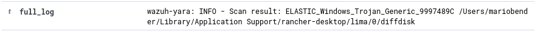

---

# False Positive Incident Report

**Incident Title:** False Positive Malware Alert  
**Document Date:** [2025-04-10]

---

## 1. Overview

Provide a brief summary of the incident. Explain that this report documents a false positive malware notification that was triggered, the subsequent investigation that was conducted, and the final resolution.

- **Purpose:** This document describes the event of a malware found notification for a MacOS machine
- **Scope:** MacOS 15.3.2

---

## 2. Incident Details

### 2.1 Incident Detection
- **Initial Detection Date:** [2025-04-02]  
- **Detected by:** [Mario Bender]  
- **Alert/Notification:**  
  

### 2.2 Affected User/Device
- **User Name:** [Mario Bender]  
- **Device ID/Hostname:** [ID 057]

---

## 3. Investigation Details

### 3.1 Malware file 
- **Initial Assessment:**  
  The location of the file detected as malware is:
  `/Users/mariobender/Library/Application Support/rancher-desktop/lima/0/diffdisk`

- **Purpose of the file:**  
  According to @jandubois in this [issue conversation](https://github.com/rancher-sandbox/rancher-desktop/issues/2285#issuecomment-1139744770)
  
  This file is the persistent disk of a virtual machine.
  
- **Further Investigation:** 
  Through further investigation, the yara rules were run against virtual machine (vmware) files found on @MarantosGeorge work laptop.
  
  The above directories detected with malware are all persistent disks for the virtual machines.

### 3.2 Findings
- **False Positive Identification:**  
  From the investigation, the yara rules are picking up persistent volumes from virtual machines as malware.
- **Root Cause Analysis:**  
  Explain the factors that contributed to the false positive (e.g., misconfigured security rules, signature errors, heuristic detection limitations).

---

## 4. Conclusion & Recommendations

### 4.1 Summary of the Incident
- Summarize the overall incident and the key outcomes of the investigation.
- Confirm that no actual malware was present on the user’s machine.

---

# Second False Positive Incident Report

**Incident Title:** Malware Detected by Yara Scan
**Document Date:** [2025-04-11]

---

## 1. Overview

This section provides a brief summary of the incident where an automated phishing alert erroneously flagged a legitimate email. The report details the alert, the subsequent review process, and verifies that no phishing activity occurred.

- **Purpose:** This document records the incident of an email mistakenly flagged as suspicious, outlines the review process, and confirms that the notification was a false positive.  
- **Scope:** Identify the affected email system, the user involved, and the corrective actions implemented.

---

## 2. Incident Details

### 2.1 Incident Detection
- **Initial Detection Date:** [2025-04-11]  
- **Detected by:** [Martin Biskupek]
- **Alert/Notification:**  

### 2.2 Affected User/Device
- **User Name:** [Martin Biskupek]  
- **Device ID/Hostname:** [ID 060]

---

## 3. Investigation Details

### 3.1 Malware File
- **Initial Assessment:**  
  A preliminary review examined the email header, content structure, and sender verification procedures.  
- **Purpose of the File:**  
  The investigation involved analyzing email metadata, cross-referencing the sender’s domain against approved lists, and manually inspecting the email for indicators of phishing.  
- **Further Investigation:**  
  Teams including IT Support, Security Operations, Email Administration, and Compliance participated in the review.

### 3.2 Findings
- **False Positive Identification:**  
  The review determined that the alert was caused by a misinterpretation of standard email formatting, which the automated system incorrectly flagged as anomalous.  
- **Root Cause Analysis:**  
  Factors contributing to the false positive included automated filtering thresholds that were too sensitive, and minor header formatting irregularities that did not indicate malicious intent.

---

## 4. Conclusion & Recommendations

### 4.1 Summary of the Incident
- 
- **Recommendations:**  

---
